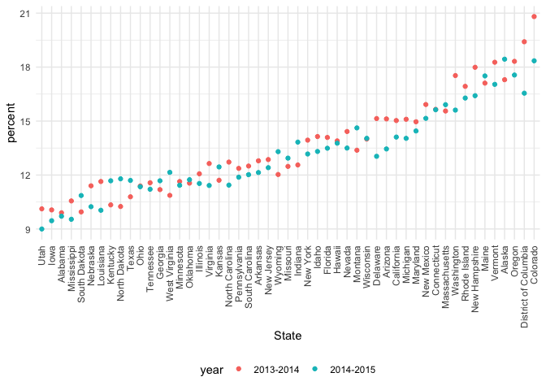
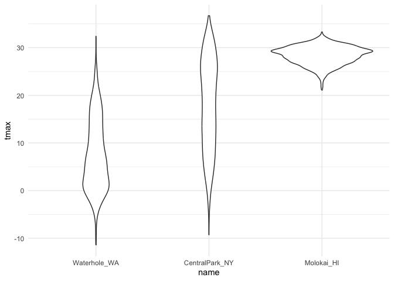

Strongs and factors
================

## Two major paths

1.  there is data included as content on a webpage, and you want to
    ‘scrape’ those data

- table from Wikipedia
- reviews from Amazon
- cast and characters on IMBD

2.  there is a dedicated server holding data in a relatively usable
    form, and you want yo ask for those data

- open NYC data
- Data.gov
- Star Wars API (Application Programming Interfaces)

## Strings and regex

``` r
string_vec = c("my", "name", "is", "jeff")

#`str_etect` the presence or absence of a pattern in a string
str_detect(string_vec, "jeff") #does "jeff" exist in the string
```

    ## [1] FALSE FALSE FALSE  TRUE

``` r
#[1] FALSE FALSE FALSE  TRUE


#replace pattern
str_replace(string_vec, "jeff", "Jeff")
```

    ## [1] "my"   "name" "is"   "Jeff"

``` r
string_vec = c(
  "i think we all rule for participating",
  "i think i have been caught",
  "i think this will be quite fun actually",
  "it will be fun, i think"
  )

#start with "i think" by using ^ at the beginning
str_detect(string_vec, "^i think")
```

    ## [1]  TRUE  TRUE  TRUE FALSE

``` r
#end with "i think" by using $ at the end
str_detect(string_vec, "i think$")
```

    ## [1] FALSE FALSE FALSE  TRUE

``` r
string_vec = c(
  "Y'all remember Pres. HW Bush?",
  "I saw a green bush",
  "BBQ and Bushwalking at Molonglo Gorge",
  "BUSH -- LIVE IN CONCERT!!"
)

#to detect both "Bush" and "bush"
str_detect(string_vec, "[Bb]ush")
```

    ## [1]  TRUE  TRUE  TRUE FALSE

``` r
#[1]  TRUE  TRUE  TRUE FALSE
```

``` r
string_vec = c(
  "Time for a Pumpkin Spice Latte!",
  "went to the #pumpkinpatch last weekend",
  "Pumpkin Pie is obviously the best pie",
  "SMASHING PUMPKINS -- LIVE IN CONCERT!!"
  )

str_detect(string_vec,"[Pp]umpkin")
```

    ## [1]  TRUE  TRUE  TRUE FALSE

``` r
string_vec = c(
  '7th inning stretch',
  '1st half soon to begin. Texas won the toss.',
  'she is 5 feet 4 inches tall',
  '3AM - cant sleep :('
  )

#want to find number first, immediately follow by characters
str_detect(string_vec, "^[0-9][a-zA-Z]")
```

    ## [1]  TRUE  TRUE FALSE  TRUE

``` r
#[1]  TRUE  TRUE FALSE  TRUE
```

``` r
string_vec = c(
  'Its 7:11 in the evening',
  'want to go to 7-11?',
  'my flight is AA711',
  'NetBios: scanning ip 203.167.114.66'
  )

#`^` target any special character at the beginning;
#`.` target any special character in the middle;
#`$` target ant special character at the end;
str_detect(string_vec, "7.11")
```

    ## [1]  TRUE  TRUE FALSE  TRUE

``` r
#[1]  TRUE  TRUE FALSE  TRUE

#if we want to target only `7.11`, dectect actual dot `.`
str_detect(string_vec, "7\\.11")
```

    ## [1] FALSE FALSE FALSE  TRUE

``` r
string_vec = c(
  'The CI is [2, 5]',
  ':-]',
  ':-[',
  'I found the answer on pages [6-7]'
  )

# to detect specific special character, using "\\"
str_detect(string_vec, "\\[")
```

    ## [1]  TRUE FALSE  TRUE  TRUE

``` r
#[1]  TRUE FALSE  TRUE  TRUE
```

## Factors

``` r
factor_vec = factor(c("male","male","female","female"))
factor_vec
```

    ## [1] male   male   female female
    ## Levels: female male

``` r
#[1] male   male   female female
#Levels: female male (based on alphabet)

as.numeric(factor_vec)
```

    ## [1] 2 2 1 1

``` r
#[1] 2 2 1 1; female = 2, male = 1 
```

what happen if i relevel ..

``` r
factor_vec = fct_relevel(factor_vec, "male")
factor_vec
```

    ## [1] male   male   female female
    ## Levels: male female

``` r
#[1] male   male   female female
#Levels: male female

as.numeric(factor_vec)
```

    ## [1] 1 1 2 2

``` r
#[1] 1 1 2 2; male = 1, female = 2
```

## NSDUH – Strings

read in the html

``` r
url = "https://samhda.s3-us-gov-west-1.amazonaws.com/s3fs-public/field-uploads/2k15StateFiles/NSDUHsaeShortTermCHG2015.htm"

drug_use_html = read_html (url)
```

extract the table(s); focus on the first one

``` r
table_marj <- html_nodes(drug_use_html, css = "table")[[1]] |> #use [[1]] extract the first item
  html_table() |> # to gengerate a table to read
  slice(-1) |> #elimate first row "notes" 
  as_tibble() #convert to table
```

``` r
data_marj <- 
  table_marj |>
  select(-contains("P Value")) |>   # Select all columns except those with "P Value"
  pivot_longer(
    cols = -State,                  # Specify columns to keep in long format
    names_to = "age_year",
    values_to = "percent"           # Specify the output column name for values
  ) |> 
  separate(age_year, into = c("age", "year"), sep = "\\(") |> 
  mutate(
    year = str_replace(year, "\\)", ""),      # Remove the closing parenthesis from `year`
    percent = str_replace(percent, "[a-c]$", ""),  # Remove specific trailing characters from `percent`
    percent = as.numeric(percent)             # Convert `percent` to numeric
  ) |> 
  filter(!(State %in% c("Total U.S.", "Northeast", "Midwest", "South", "West"))) # Filter out specific regions
```

## NSDUH – Factors

``` r
data_marj |>
  filter(age == "12-17") |> 
  mutate(State = fct_reorder(State, percent))|> #put state in order with percentage
  ggplot(aes(x = State, y = percent, color = year)) +  
  geom_point() +
  theme(axis.text.x = element_text(angle = 90, vjust = 0.5, hjust = 1))
```

<!-- -->

# load weater data

``` r
weather_df = 
  rnoaa::meteo_pull_monitors(
    c("USW00094728", "USW00022534", "USS0023B17S"),
    var = c("PRCP", "TMIN", "TMAX"), 
    date_min = "2021-01-01",
    date_max = "2023-12-31") |>
  mutate(
    name = recode(
      id, 
      USW00094728 = "CentralPark_NY", 
      USW00022534 = "Molokai_HI",
      USS0023B17S = "Waterhole_WA"),
    tmin = tmin / 10,
    tmax = tmax / 10) |>
  select(name, id, everything())
```

    ## using cached file: /Users/carriewww/Library/Caches/org.R-project.R/R/rnoaa/noaa_ghcnd/USW00094728.dly

    ## date created (size, mb): 2024-10-28 19:36:31.594818 (8.657)

    ## file min/max dates: 1869-01-01 / 2024-10-31

    ## using cached file: /Users/carriewww/Library/Caches/org.R-project.R/R/rnoaa/noaa_ghcnd/USW00022534.dly

    ## date created (size, mb): 2024-10-28 19:36:46.039162 (3.938)

    ## file min/max dates: 1949-10-01 / 2024-10-31

    ## using cached file: /Users/carriewww/Library/Caches/org.R-project.R/R/rnoaa/noaa_ghcnd/USS0023B17S.dly

    ## date created (size, mb): 2024-10-28 19:36:50.646793 (1.039)

    ## file min/max dates: 1999-09-01 / 2024-10-31

``` r
weather_df |>
  mutate(name = fct_reorder(name,tmax))|> # it reorders the name factor based on the tmax (maximum temperature) values.
  ggplot(aes(x = name, y = tmax)) +
  geom_violin()
```

    ## Warning: There was 1 warning in `mutate()`.
    ## ℹ In argument: `name = fct_reorder(name, tmax)`.
    ## Caused by warning:
    ## ! `fct_reorder()` removing 19 missing values.
    ## ℹ Use `.na_rm = TRUE` to silence this message.
    ## ℹ Use `.na_rm = FALSE` to preserve NAs.

    ## Warning: Removed 19 rows containing non-finite outside the scale range
    ## (`stat_ydensity()`).

<!-- -->

``` r
  lm(tmax ~ name, data = weather_df) #data coming from the pipe (i.e., weather_df), represented by the dot (.).
```

    ## 
    ## Call:
    ## lm(formula = tmax ~ name, data = weather_df)
    ## 
    ## Coefficients:
    ##      (Intercept)    nameMolokai_HI  nameWaterhole_WA  
    ##            17.87             10.53            -10.31

``` r
#lm() linear regression
```
